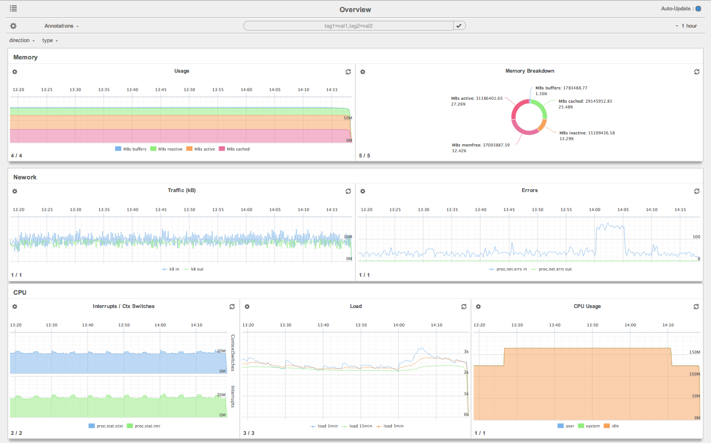
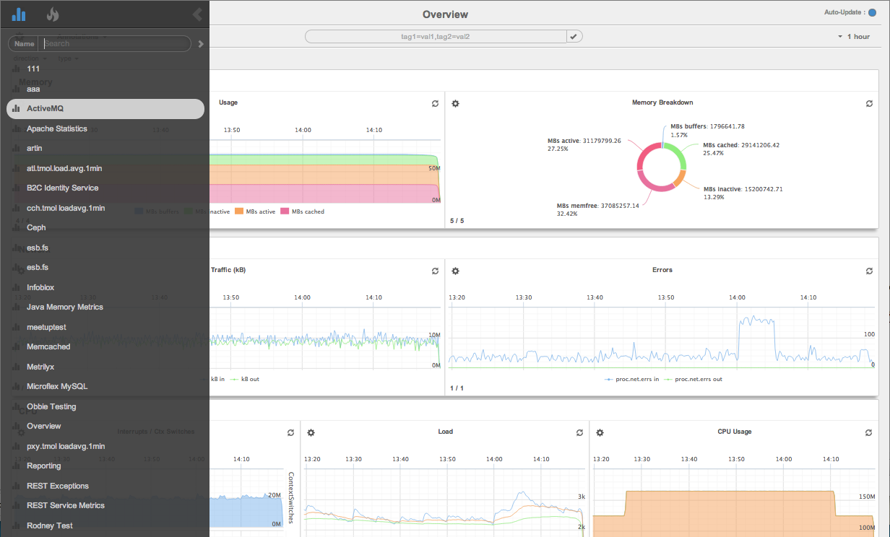

Metrilyx v2.4.0
===============
Metrilyx is a web based dashboard engine to OpenTSDB, a time series database used to store large amounts of data.  It allows for analyzing, cross cutting and viewing of time series data in a simple manner.

#### Features:
- **Data Analysis / Metric Operations:** Perform mathematical operations across metrics to create secondary metrics.  Aggregate data by max, min, mean or any other calculation for further analysis and comparison.
- **Easy Dashboards:** Create beautiful dashboards simply by dragging and dropping metrics onto graphs.  Drag n' drop pods, graph, columns and rows to re-arrange the layout.  Select from a variety of graph types such as spline, area, stacked, pie, and line to view and analyze your data in different days.
- **Event Annotations:** Annotate your graphs with various events occurring in your ecosystem allowing to co-relate spikes and dips in performance graphs with events giving more context.
- **WebSocket Data Delivery**: Recieve data with a lower protocol overhead using websockets accompanied with per message compression.
- **Richer Metric Search:** Perform full regular expression searches on metrics and tags,  addressing OpenTSDB's search limitation by allowing the user to perform more complex queries for a better user experience.  Obtain deeper insight into the available metrics and tags in the environment as well as into the existing systems via the full visibility of tags.
- **Distributed, Highly-Available, Redundant**: Setup multiple hosts to scale out, provide high availability and redundancy.
- **Simple URL's**: Simple and readable URL format for sharing and manipulating.

#### Getting Started
To quickly get up and running, follow the  [Quick Start](https://github.com/Ticketmaster/metrilyx-2.0/blob/master/docs/QuickStart.rst "Quick Start") guide.

#### Screenshots
##### Adhoc Graphs

##### Dashboards

##### Edit Mode

**Notes**

- Please be aware that although the project has a Apache license, the graphing library is under the creative commons license.
- The default username and password for the site are admin and metrilyx respectively. Changing these will cause the application to stop functioning as other configurations also need to be updated.  This should not be harmful as metrilyx does not store any sensitive information.
