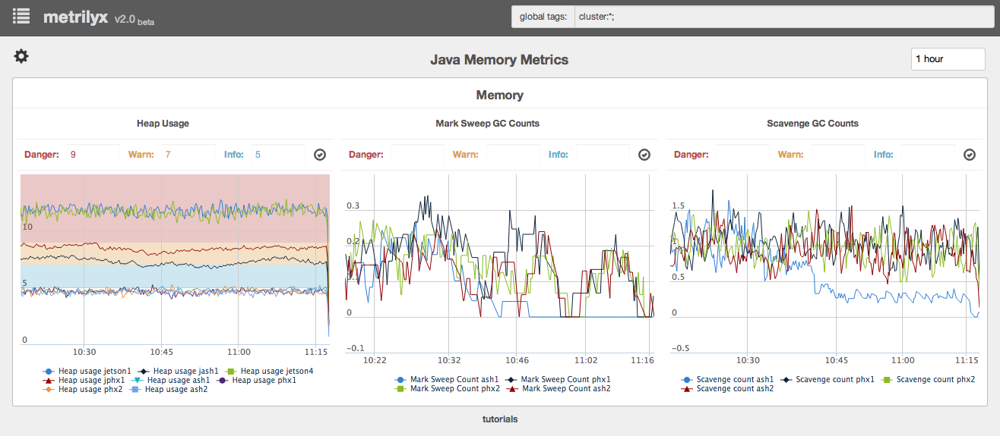
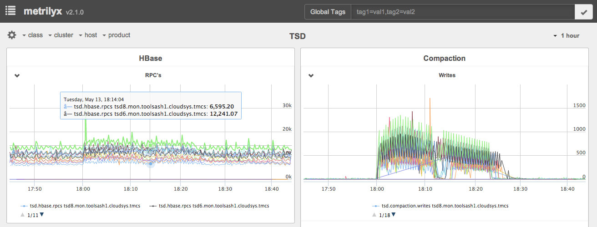
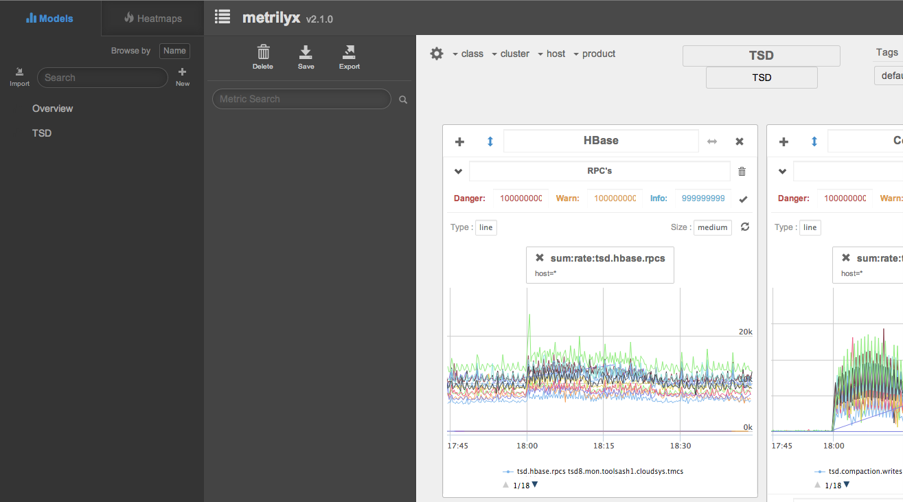

Metrilyx v2.2.0
===============
Metrilyx is a web based dashboard engine  to OpenTSDB, a time series database used to store large amounts of data.  It allows for analyzing, cross cutting and viewing of time series data in a simple manner.

#### Features:
##### v2.2.0
- Major performance improvements.
	- Data delivery system now completely **asynchronous**.
	- Data provided through **websockets**.
	- In flight data **compression** (permessage-deflate).
- **Nginx** used as reverse proxy rather than apache.
- Support for **distributed** and **HA** setup.

##### v2.1.0
- Ability to group pages based on tags.
- Ability to generate heatmaps against a metric.
- Ability to import and export pages.
- Updated graphing library to Highstock 2.0.1
- Improved the ability to move pods around on a page.
- Various performance improvements and bug fixes.

#### Screenshots
##### Overview

##### Page listing

##### Edit Mode

 
### Requirements
Metrilyx will run on any system that supports the packages mentioned below.  It has primarily been tested on RedHat based flavors of Linux.

#### OS Packages:
##### RHEL:
	yum -y install libuuid uuid nginx python-setuptools python-devel gcc mongodb
	
##### Debian:
	apt-get install libuuid1 uuid-runtime nginx python-setuptools python-dev libpython-dev make mongodb

#### Python Packages:
	uuid
	django
	djangorestframework
	django-filter
	django-cors-headers
	django-reversion
	twisted	
	celery
	requests
	jsonfield
	uwsgi
	pymongo
	autobahn

### Installation
The provided install script will work with both **RedHat** and **Debian** based distributions.  You can issue the command below to install the application after the above mentioned requirements have been satisfied. The default install destination is **/opt/metrilyx**.	

- Install the required OS packages.
- Issue the following command to install the application:
	
	$ git clone https://github.com/Ticketmaster/metrilyx-2.0.git
	$ cd metrilyx-2.0
	$ ./install.sh app

Assuming all required OS packages are installed, the script will install the needed python modules, nginx configs depending on your distribution and prompt you to edit the metrilyx configuration file.

After you have completed editing the configuration file, start the modelmanager and dataserver processes, then restart nginx.  Also start celeryd and celerybeat which consume and run periodic jobs repsectively.
	
	/etc/init.d/metrilyx-dataserver start
	
	/etc/init.d/metrilyx-modelmanager start

	/etc/init.d/nginx restart

	/etc/init.d/celeryd start

	/etc/init.d/celerybeat start

The default system nginx configuration may conflict with the metrilyx one.  In this case you'll need to disable the default one or edit the configuration file to accomodate the metrilyx nginx configuration.

### Configuration
The default installation directory is /opt/metrilyx.

#### /opt/metrilyx/etc/metrilyx/metrilyx.conf
A sample configuration file has been provided.  The configuration file is in JSON format.  
	
	{
		"dataproviders": [{
			"uri":"http://tsdb.example.com",
			"query_endpoint": "/api/query",
			"search_endpoint": "api/suggest",
			"suggest_limit": 100
		}],
		"databases":[{
			"ENGINE": "django.db.backends.sqlite3",
            "NAME": "metrilyx.sqlite3"
		}],
		"heatmaps": {
			"analysis_interval": "1m-ago",
			"transport": "mongodb",
			"broker": {
		    	"host": "127.0.0.1",
		    	"port": 27017,
		    	"database": "jobs", 
		    	"taskmeta_collection": "taskmeta_collection"
			}
		},
		"celery": {
			"tasks": [
				"metrilyx.heatmap_tasks"
			]
		},
		"debug": false
	}
	
##### tsdb.uri
OpenTSDB http host

##### tsdb.port
OpenTSDB http port (default: 4242)

##### tsdb.suggest_limit
OpenTSDB suggest max result limit. 

##### heatmaps
This configuration option is only need if you plan to use heatmaps. If you choose to enable this feature the only needed change is the mongodb information relative to your setup i.e. host, port, and database

##### databases
The default uses sqlite.  Other databases can also be used.  We have testing with postgresql.  This requires a seperate set of tasks that will be included later.

#### /opt/metrilyx/metrilyx/static/config.js
This is the client side configuration file. A sample for this configuration has also been provided.

##### AUTHCONFIG
This does not need to be changed.  This is a placeholder for a future feature to allow user authentication.

##### SERVER_NAME
Client accessible ip address or fqdn.  This is the address used by the websocket client.  This is the only required option in this configuration file.

##### WS_URI
The websocket URI used by the client.  This is made up of the SERVER_NAME and connection options.  This does not need to be edited.

### Heat Maps
Heatmaps are used to view your top 10 consumers for a given metric.  They are created similarly to pages.  The only subtly is the "pivot tag" which is the tag used to calculate the top 10.  This is usually the tag containing a value of '*'.

Heatmap jobs are stored in the application directory in 'heatmaps.json'.  The heatmap dashboards are stored in a directory called 'heatmaps' in the application directory.

In order to use heatmaps, you will need a mongodb server.  Heatmap computations are performed using celery (a python distributed processing framework) which uses mongodb for its backend.  For scalability more celery worker nodes can be added.  To install simply download the application on the node in question and run the install script.

#####Start the heatmap generator.  (only 1 instance of this should be running)
	/etc/init.d/celerybeatd start
	
#####Start the heatmap processor.  (these can run on as many nodes as you like)
	/etc/init.d/celeryd start

#### Importing models
You will need to import page models from v2.0 to v2.1 as 2.1 uses a database to store the models.  During the installation process, the installer backups the current installation with a timestamp.

You can import models from the UI but you may also import them via CLI.  You can issue the following command to import a json page model (i.e. graphmap).

	curl -u admin:metrilyx http://localhost/api/graphmaps -H "Content-Type:application/json" -d @<path/to/json/model>

The above will import a graphmap (i.e. page).  To import a heatmap you can use the following endpoint:

	curl -u admin:metrilyx http://localhost/api/heatmaps -H "Content-Type:application/json" -d @<path/to/heatmap/model>
	
To import all existing graphmaps from v2.0, issue the following commands:

	$ cd /opt/metrilyx-<timestamp>/pagemodels
	$ for i in $(ls);do curl -u admin:metrilyx http://localhost/api/graphmaps -H "Content-Type:application/json" -d @./$i; done
	
Similarly to import all existing heatmaps from v2.0, issue the following commands:

	$ cd /opt/metrilyx-<timestamp>/heatmaps
	$ for i in $(ls);do curl -u admin:metrilyx http://localhost/api/heatmaps -H "Content-Type:application/json" -d @./$i; done

#### Notes
- The default username and password for the site are admin and metrilyx respectively. Changing these will cause the application to stop functioning as other configurations also need to be updated.
- If you would like to change the password, change to the application installation directory.  Remove the file called **metrilyx.sqlite3** and run **python manage.py syncdb**.  This should prompt you to create a new admin user.  Type 'yes', and follow the prompts to create a new username and password.  You will also need to update the config.js appropriately.
- Please be aware that although the project has a MIT license, the graphing library is under the creative commons license.